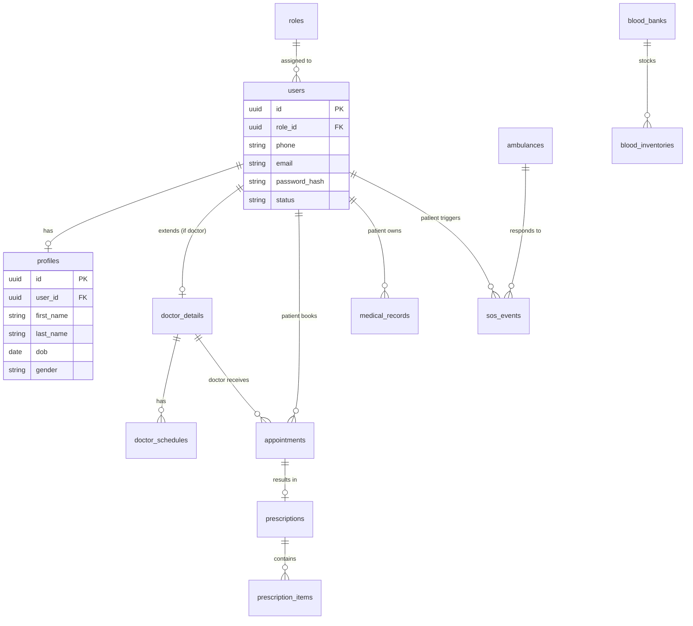

# Healthcare Ecosystem Database Design

This document details the production-grade PostgreSQL schema designed to support 1 million+ users, adhering to Third Normal Form (3NF), optimized indexing, and strict audit compliance.

---

## 1. Entity-Relationship (ER) Diagram

---

## 2. Naming Convention & Audit Fields

*   **Tables & Columns:** `snake_case` (e.g., `doctor_details`, `created_at`).
*   **Primary Keys:** `id` (Type: UUID v4).
*   **Foreign Keys:** `[entity]_id` (e.g., `user_id`).
*   **Mandatory Audit Fields (All Tables):**
    *   `created_at`: Timestamp with time zone (Default: NOW()).
    *   `updated_at`: Timestamp with time zone (Auto-updated via trigger).
*   **Soft Delete Fields (Transactional Tables):**
    *   `deleted_at`: Timestamp with time zone (Nullable).

---

## 3. Table Definitions & Columns

### 3.1 Identity & Access
**`roles`**
*   `id` (UUID, PK)
*   `name` (VARCHAR, Unique) - e.g., 'PATIENT', 'DOCTOR', 'ADMIN', 'MODERATOR'
*   `description` (VARCHAR)

**`users`**
*   `id` (UUID, PK)
*   `role_id` (UUID, FK -> roles.id)
*   `phone` (VARCHAR, Unique, Indexed)
*   `email` (VARCHAR, Unique, Indexed, Nullable)
*   `password_hash` (VARCHAR)
*   `status` (VARCHAR) - 'ACTIVE', 'SUSPENDED', 'PENDING'
*   *Audit + Soft Delete fields*

### 3.2 User Profiles
**`profiles`**
*   `id` (UUID, PK)
*   `user_id` (UUID, FK -> users.id, Unique)
*   `first_name` (VARCHAR)
*   `last_name` (VARCHAR)
*   `dob` (DATE)
*   `gender` (VARCHAR)
*   `avatar_url` (VARCHAR, Nullable)
*   *Audit fields*

**`doctor_details`**
*   `id` (UUID, PK)
*   `user_id` (UUID, FK -> users.id, Unique)
*   `specialization` (VARCHAR, Indexed)
*   `license_number` (VARCHAR, Unique)
*   `consultation_fee` (DECIMAL)
*   `is_verified` (BOOLEAN, Default: False)
*   *Audit fields*

### 3.3 Consultations & Scheduling
**`doctor_schedules`**
*   `id` (UUID, PK)
*   `doctor_id` (UUID, FK -> doctor_details.id)
*   `day_of_week` (SMALLINT) - 0(Sun) to 6(Sat)
*   `start_time` (TIME)
*   `end_time` (TIME)
*   *Audit fields*

**`appointments`**
*   `id` (UUID, PK)
*   `patient_id` (UUID, FK -> users.id)
*   `doctor_id` (UUID, FK -> doctor_details.id)
*   `schedule_date` (DATE)
*   `start_time` (TIME)
*   `status` (VARCHAR) - 'PENDING', 'CONFIRMED', 'COMPLETED', 'CANCELED'
*   *Audit + Soft Delete fields*

### 3.4 Medical Records
**`prescriptions`**
*   `id` (UUID, PK)
*   `appointment_id` (UUID, FK -> appointments.id, Unique)
*   `patient_id` (UUID, FK -> users.id)
*   `doctor_id` (UUID, FK -> doctor_details.id)
*   `notes` (TEXT)
*   `pdf_url` (VARCHAR)
*   *Audit + Soft Delete fields*

**`prescription_items`**
*   `id` (UUID, PK)
*   `prescription_id` (UUID, FK -> prescriptions.id)
*   `medicine_name` (VARCHAR)
*   `dosage` (VARCHAR)
*   `duration` (VARCHAR)
*   `instructions` (VARCHAR)

**`medical_records`**
*   `id` (UUID, PK)
*   `patient_id` (UUID, FK -> users.id)
*   `title` (VARCHAR)
*   `file_url` (VARCHAR)
*   `file_type` (VARCHAR)
*   *Audit + Soft Delete fields*

### 3.5 Emergency & Logistics
**`ambulances`**
*   `id` (UUID, PK)
*   `driver_name` (VARCHAR)
*   `vehicle_number` (VARCHAR, Unique)
*   `phone` (VARCHAR, Unique)
*   `is_available` (BOOLEAN)
*   `current_lat` (DECIMAL)
*   `current_lng` (DECIMAL)
*   *Audit fields*

**`sos_events`**
*   `id` (UUID, PK)
*   `patient_id` (UUID, FK -> users.id)
*   `ambulance_id` (UUID, FK -> ambulances.id, Nullable)
*   `lat` (DECIMAL)
*   `lng` (DECIMAL)
*   `status` (VARCHAR) - 'TRIGGERED', 'DISPATCHED', 'RESOLVED'
*   `resolved_at` (TIMESTAMP, Nullable)
*   *Audit fields*

---

## 4. Constraints & Relationships

*   **Foreign Keys:** All FKs enforce referential integrity.
*   **ON DELETE Restrict:** Deleting a `user` is restricted if they have existing `appointments` or `prescriptions`. Soft deletes (`deleted_at`) must be used instead.
*   **Unique Constraints:** 
    *   `users(phone)`, `users(email)`
    *   `profiles(user_id)`, `doctor_details(user_id)` (1-to-1 relationships)
    *   `prescriptions(appointment_id)` (1-to-1 relationship)
*   **Check Constraints:**
    *   `appointments(start_time)` must be valid intervals.
    *   `consultation_fee` >= 0.

---

## 5. Indexes (Optimized Queries)

To support 1 million users with sub-100ms query times, the following B-Tree and specialized indexes are required:

1.  **Lookups:** `idx_users_phone`, `idx_users_email`
2.  **Foreign Key Lookups:** `idx_appointments_patient_id`, `idx_appointments_doctor_id`, `idx_medical_records_patient_id`
3.  **Filtering & Sorting:** 
    *   `idx_appointments_date_status` on `(schedule_date, status)`
    *   `idx_doctor_specialization` on `(specialization, is_verified)`
4.  **Partial Indexes:** 
    *   `CREATE INDEX idx_active_users ON users (id) WHERE deleted_at IS NULL AND status = 'ACTIVE';`
    *   This ensures queries ignore soft-deleted rows efficiently.

---

## 6. Migration Order

Database migrations must be applied strictly in this order to respect Foreign Key dependencies:
1.  `roles`
2.  `users`
3.  `profiles`, `doctor_details`
4.  `doctor_schedules`
5.  `blood_banks`, `ambulances`
6.  `appointments`
7.  `prescriptions`, `medical_records`, `sos_events`
8.  `prescription_items`, `blood_inventories`

---

## 7. Partition Strategy

As the user base scales to 1 million+, table partitioning will be required for high-velocity transaction tables to prevent index bloat and slow sequential scans:
*   **`appointments` & `sos_events`:** Range partitioning by `created_at` (e.g., Monthly partitions: `appointments_2026_01`, `appointments_2026_02`).
*   **`audit_logs` (System):** Range partitioning by `created_at` (Monthly). Old partitions can be archived to cold storage (AWS S3 via pg_dump).

---

## 8. Backup & Disaster Recovery Strategy

*   **Automated Backups:** AWS RDS Automated Backups enabled with a 35-day retention policy.
*   **WAL (Write-Ahead Logging):** Configured for Point-In-Time Recovery (PITR), allowing restoration to any exact second within the retention window.
*   **Multi-AZ:** Standby replica in a secondary Availability Zone for automatic failover with zero data loss (RPO = 0, RTO < 2 minutes).

---

## 9. Optimization Strategy

*   **Connection Pooling:** Use `PgBouncer` or Ktor's `HikariCP` to handle high concurrent connections without exhausting PostgreSQL process memory.
*   **Query Analysis:** `pg_stat_statements` extension must be enabled to track and optimize slow queries (queries taking > 50ms).
*   **Vacuuming:** Autovacuum aggressiveness tuned upward to immediately clear out dead tuples generated by heavy UPDATEs (e.g., ambulance live location tracking, though ideally live tracking uses Redis, falling back to PG only periodically).

---

## 10. Future Expansion Considerations

*   **PostGIS:** If ambulance and SOS geolocation queries become complex, the PostGIS extension can be enabled to convert `lat`/`lng` decimal columns into native `geometry(Point, 4326)` types, enabling highly optimized spatial indexing (GiST).
*   **E-Pharmacy:** Tables for `pharmacies`, `medicines`, and `orders` can seamlessly link to the existing `prescriptions` table via `prescription_id`.
*   **Wearables IoT:** A separate TimescaleDB instance (or hypertable within PG) should be considered for high-frequency time-series data like live heart rate streams.
