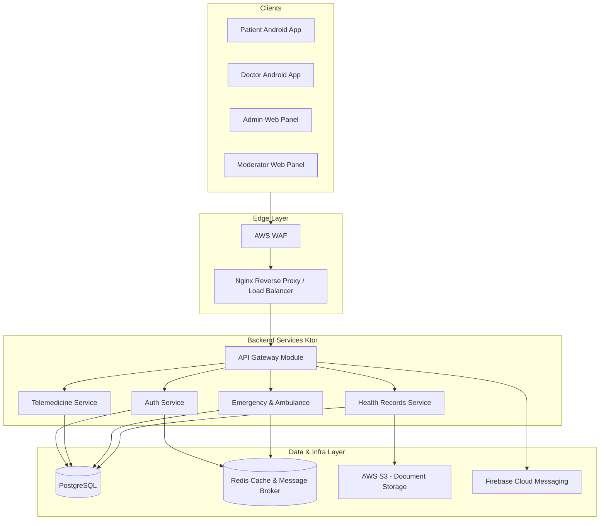
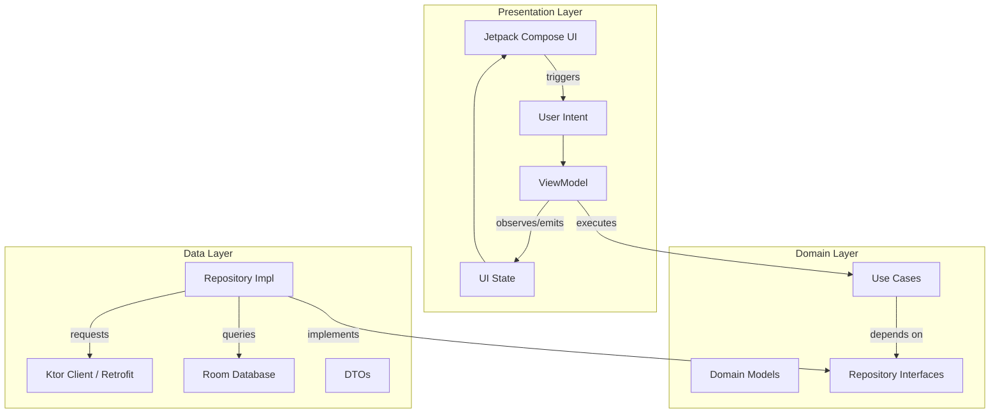
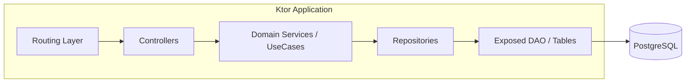
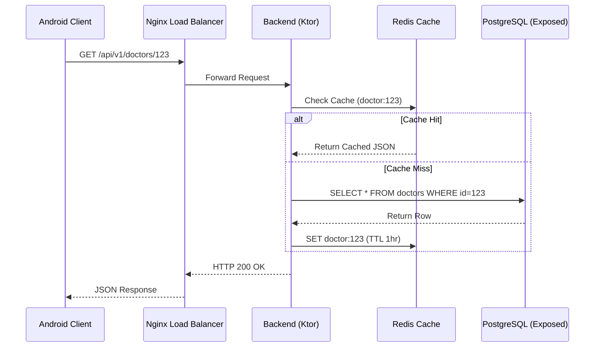
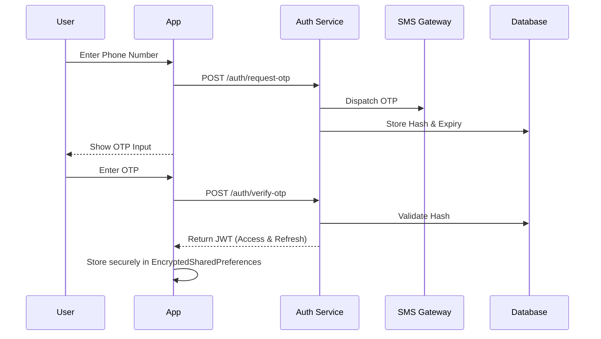
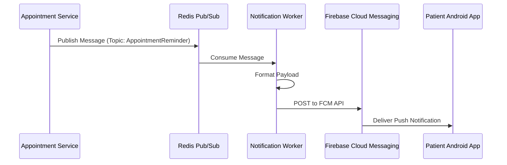
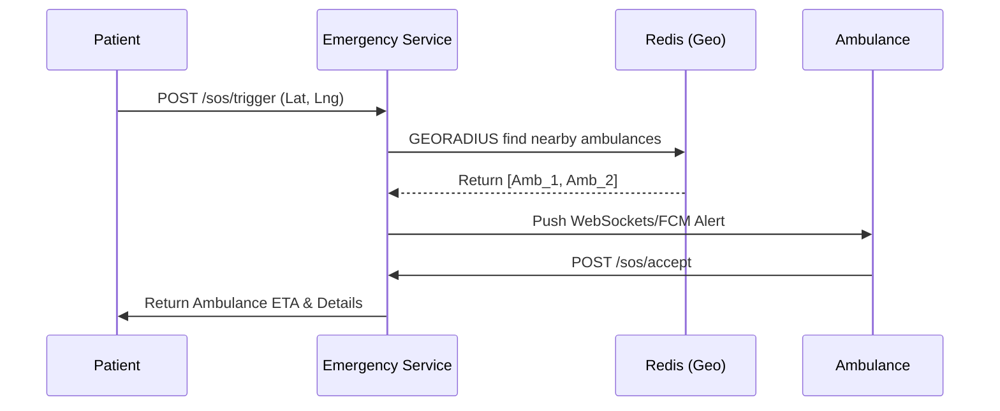
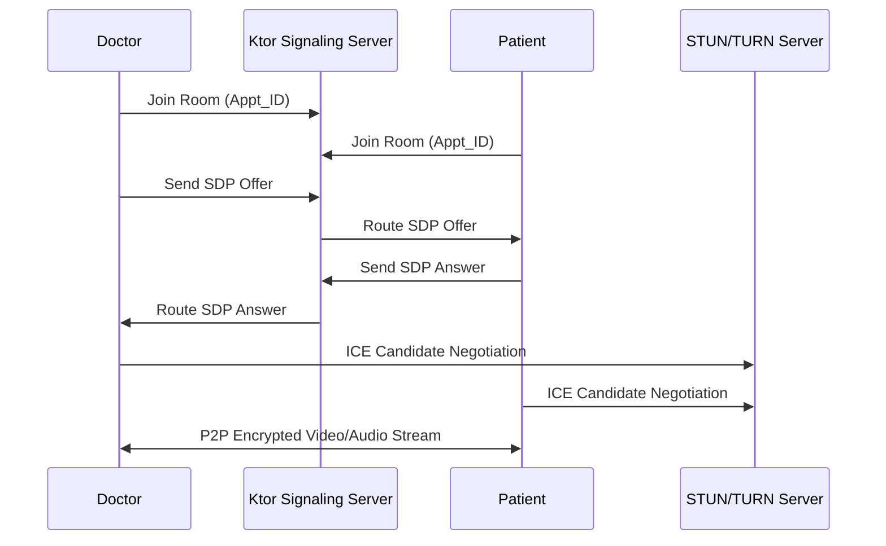
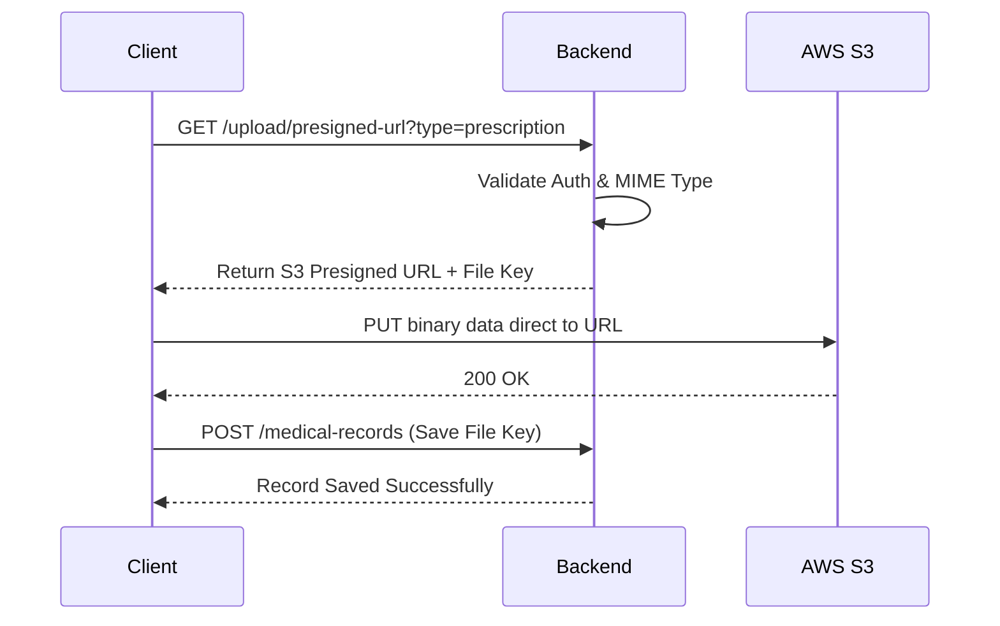
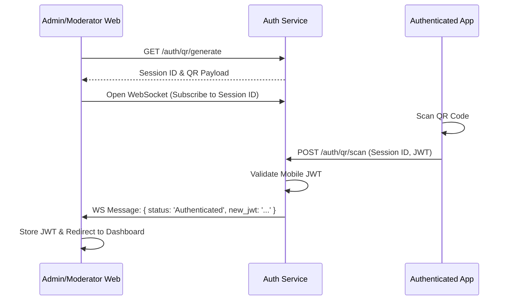

# System Architecture Document: Healthcare Ecosystem

This document defines the comprehensive architecture of the Healthcare Ecosystem, adhering to the principles outlined in the PRD, Feature Breakdown, and Project Rules.

---

## 1. High-Level Architecture

The system follows a scalable, decoupled architecture where Android clients and Web Panels interact with a central API Gateway routing to modular backend services.



---

## 2. Low-Level Architecture (Mobile)

The Android Apps utilize Clean Architecture, MVI (Model-View-Intent) for the presentation layer, and Koin for Dependency Injection.



---

## 3. Component Diagram (Backend)

The Ktor Backend follows a layered domain-driven approach using Exposed ORM.



---

## 4. Service Diagram

The backend is structured as a Modular Monolith, allowing easy splitting into Microservices if scaling demands it.

```mermaid
graph TD
    subgraph Modular Monolith
        GATEWAY[API Routing]
        
        subgraph Auth Module
            JWT[JWT Manager]
            OTP[OTP Service]
        end
        
        subgraph Appointment Module
            SCHED[Scheduler]
            SLOT[Slot Manager]
        end
        
        subgraph Emergency Module
            SOS[SOS Dispatcher]
            GEO[Geospatial Tracker]
        end
        
        subgraph Notification Module
            PUSH[Push Dispatcher]
            EMAIL[Email Sender]
        end
        
        GATEWAY --> Auth Module
        GATEWAY --> Appointment Module
        GATEWAY --> Emergency Module
        Appointment Module --> Notification Module
        Emergency Module --> Notification Module
    end
```

---

## 5. Deployment Diagram

Deployed entirely on AWS using Docker containers orchestrated via ECS/EKS or straightforward Docker-Compose on EC2 for initial phases.


---

## 6. Data Flow



---

## 7. Authentication Flow (JWT + OTP)



---

## 8. Notification Flow



---

## 9. Emergency Flow (Low Latency)



---

## 10. Video Call Flow (WebRTC via Signaling)



---

## 11. File Upload Flow (Presigned URLs)



---

## 12. QR Login Flow



---

## 13. Security Layers

*   **Edge:** AWS WAF to block SQLi, XSS, and DDoS attacks.
*   **Transport:** Strict HTTPS (TLS 1.3) requirement.
*   **Application:** 
    *   Stateless JWT Authentication.
    *   Role-Based Access Control (RBAC) middleware verifying permissions on every route.
*   **Data:** 
    *   Passwords and PINs hashed with Argon2.
    *   AWS KMS used for encrypting sensitive PHI (Personal Health Information) columns at rest.
*   **Device:** EncryptedSharedPreferences on Android for token storage. Root detection to prevent execution on compromised devices.

---

## 14. Caching Strategy

*   **L1 (In-Memory App Cache):** Room database caches patient records and upcoming schedules for offline support.
*   **L2 (Distributed Cache):** Redis stores frequent read-heavy payloads (e.g., Doctor Profiles, Blood Bank Inventories) and handles session blacklisting.
*   **TTL Configuration:** Static data (Specializations) caches for 24h. Dynamic data (Doctor availability) caches for 1-5 minutes.

---

## 15. Scalability Strategy

*   **Horizontal Scaling:** Stateless Ktor containers scaled automatically via AWS Auto Scaling Groups based on CPU/Memory thresholds.
*   **Database Scaling:** PostgreSQL Primary instance for Writes; Read Replicas configured for heavy analytics queries (Admin Dashboard).
*   **Connection Pooling:** HikariCP configured in Ktor to manage database connections efficiently.
*   **Asynchronous Processing:** Heavy tasks (PDF generation, bulk emails) are pushed to Redis queues and processed by background worker instances.

---

## 16. Monitoring Strategy

*   **APM:** Datadog or New Relic integrated into Ktor for tracing request latency and identifying bottlenecks.
*   **Infrastructure Metrics:** AWS CloudWatch monitoring EC2/RDS CPU, Memory, and Disk IO.
*   **Client Monitoring:** Firebase Crashlytics to catch Android unhandled exceptions; Sentry for Web Panel JS errors.

---

## 17. Logging Strategy

*   **Format:** Structured JSON logging (Logback in Ktor).
*   **Aggregation:** ELK Stack (Elasticsearch, Logstash, Kibana) or AWS CloudWatch Logs.
*   **Context:** Every log entry must include an injected `correlation_id` (passed from Edge -> Service -> DB) and a `user_id` (if authenticated).
*   **Masking:** Strict filters to strip PHI and auth tokens before logs are flushed.

---

## 18. Disaster Recovery

*   **Database Backups:** Automated continuous incremental backups via AWS RDS with a 35-day retention period, plus daily automated snapshots.
*   **Failover:** Multi-AZ deployment for PostgreSQL and Redis ensures automatic failover in case of a zone outage.
*   **Infrastructure as Code:** Terraform/CloudFormation scripts maintain the exact AWS state, allowing full environment recreation in a secondary region (e.g., from `us-east-1` to `us-west-2`) within 30 minutes.
