# Healthcare Ecosystem User Flows

This document outlines the complete user journeys and systemic flows for the Patient, Doctor, Admin, and Moderator interfaces using Mermaid diagrams.

---

## 1. User Journeys: Patient

### 1.1 Primary Journey: Booking a Consultation
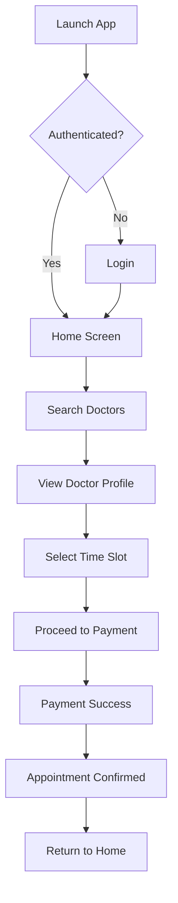

### 1.2 Alternative Journey: Emergency SOS
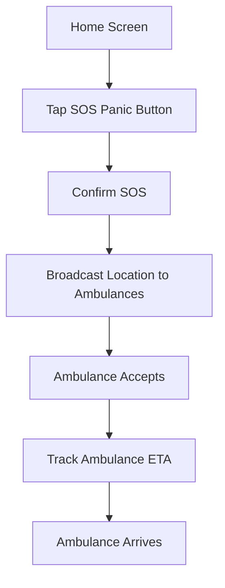

### 1.3 Failure Journey: Payment Failure
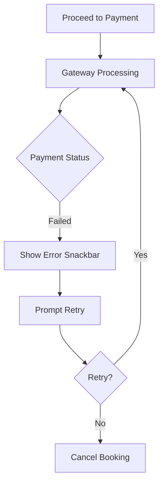

### 1.4 Offline Journey: Viewing Schedule
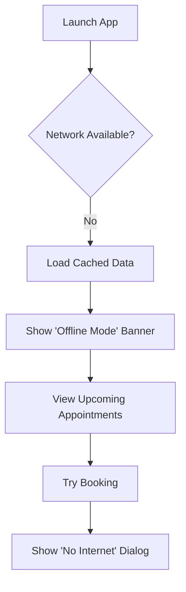

### 1.5 Recovery Journey: Forgot Password
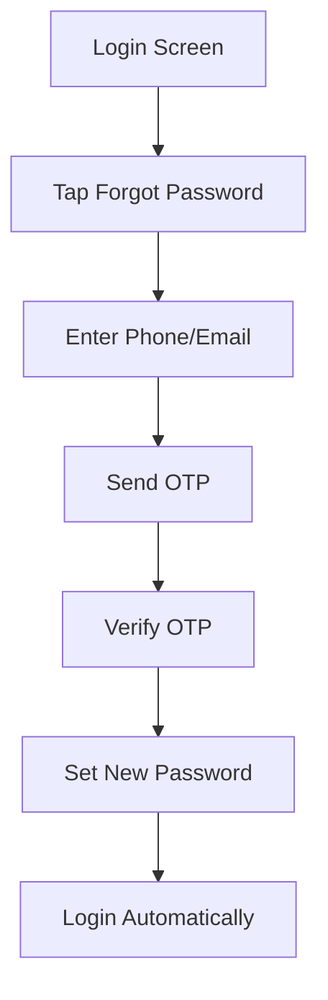

---

## 2. User Journeys: Doctor

### 2.1 Primary Journey: Conducting a Consultation
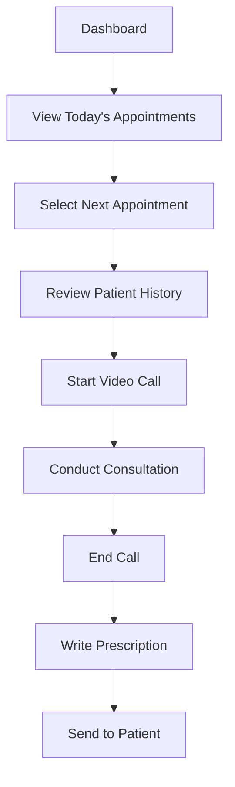

### 2.2 Alternative Journey: Rescheduling
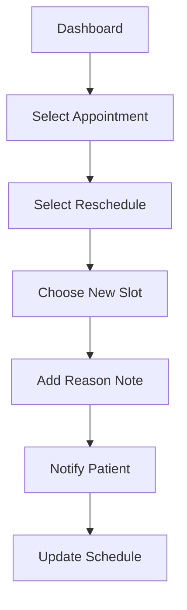

### 2.3 Failure Journey: Network Drop During Call
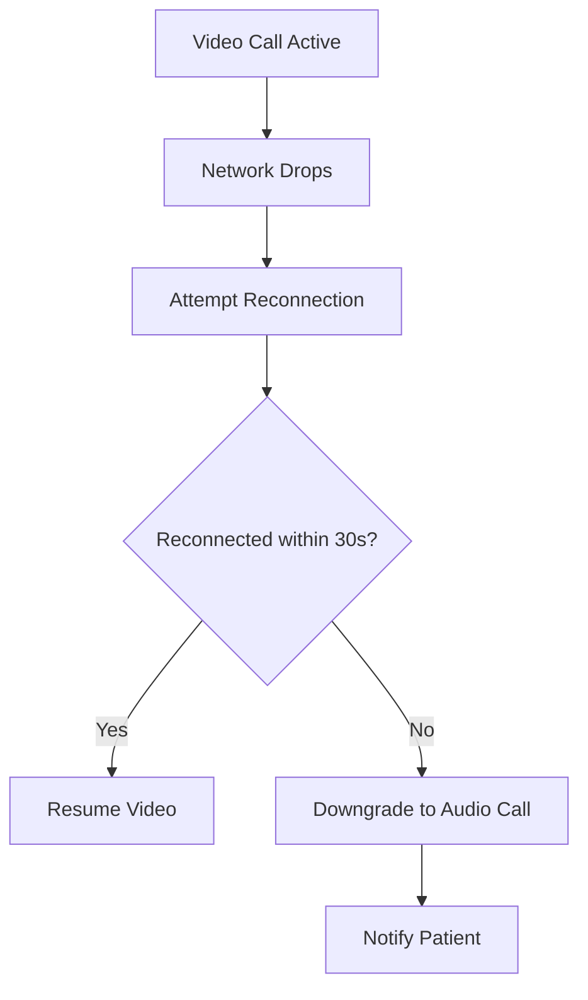

### 2.4 Offline Journey: Viewing Schedule
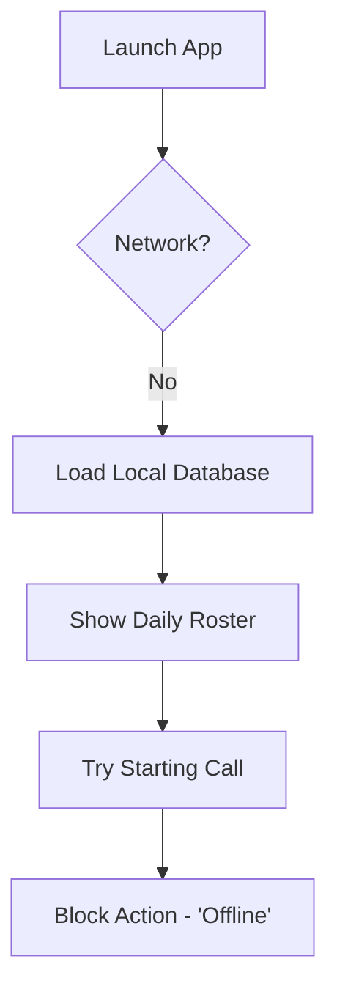

### 2.5 Recovery Journey: Disputed Consultation
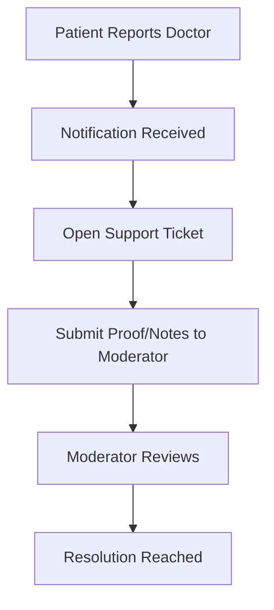

---

## 3. User Journeys: Admin

### 3.1 Primary Journey: System Monitoring
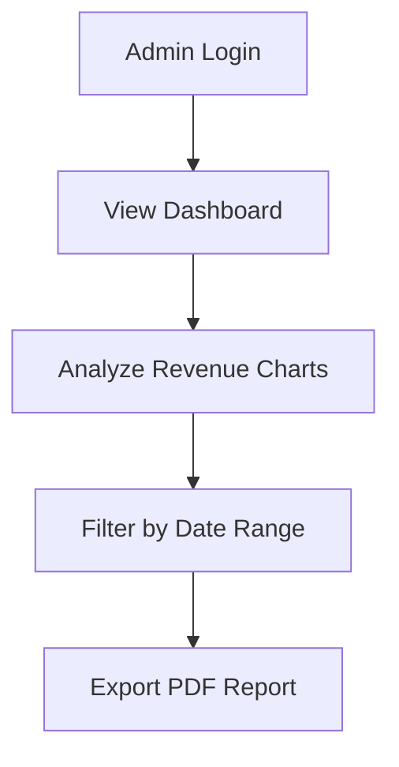

### 3.2 Alternative Journey: Role Assignment
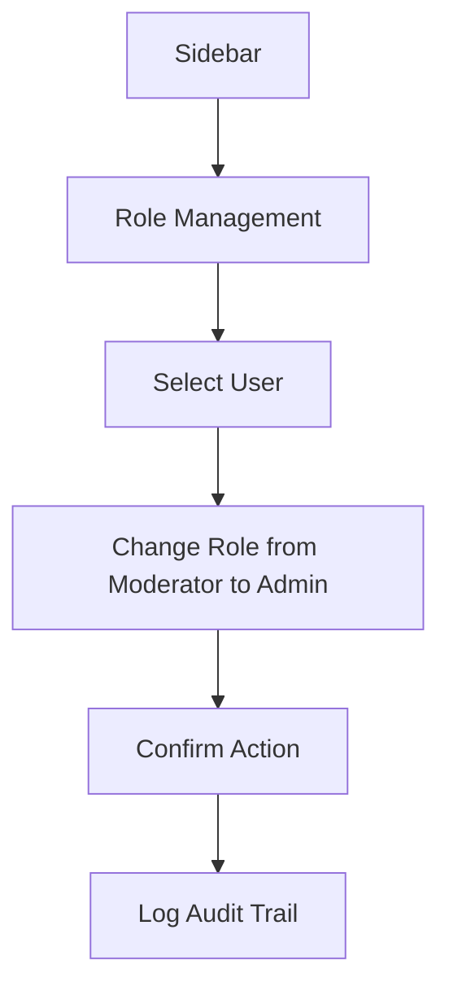

### 3.3 Failure Journey: Unauthorized Access
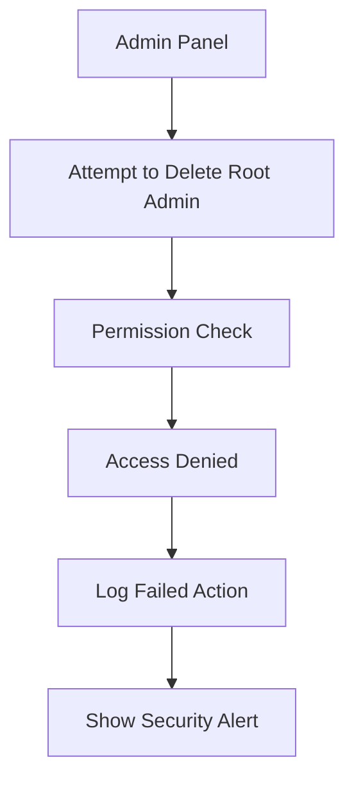

*(Admin/Moderators do not have Offline Journeys as web panels strictly require internet)*

---

## 4. User Journeys: Moderator

### 4.1 Primary Journey: Verifying a Doctor
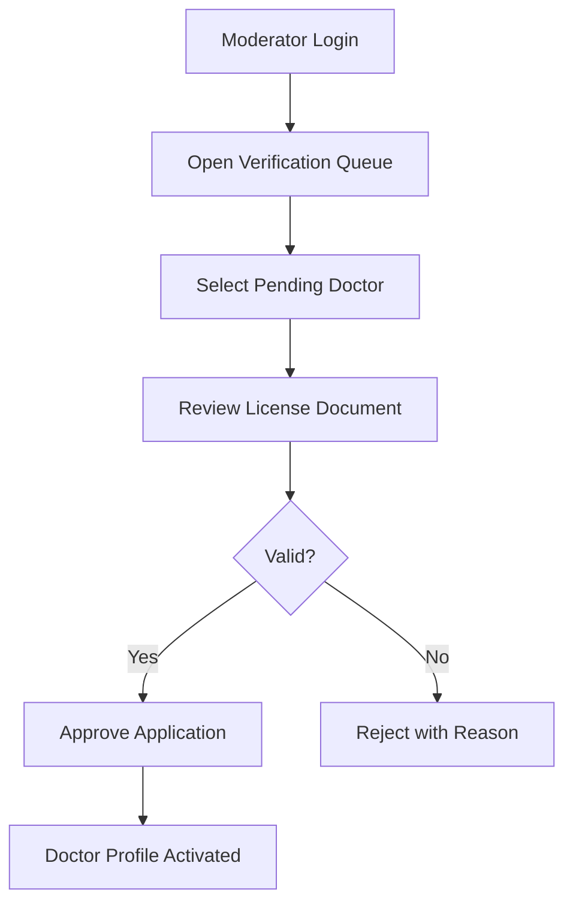

### 4.2 Alternative Journey: Resolving Dispute
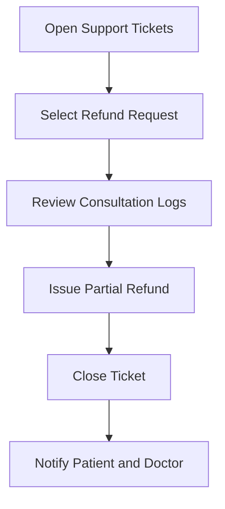

### 4.3 Failure Journey: Document Fetch Error
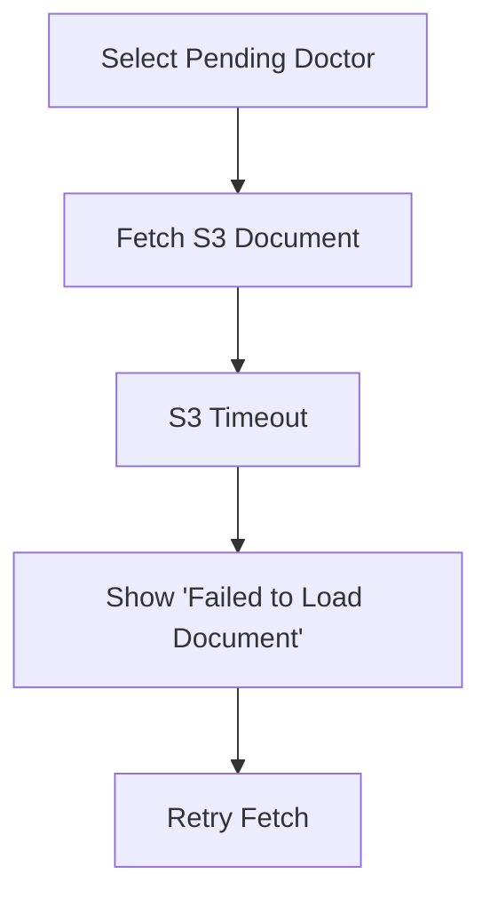

---

## 5. Systemic Flows

### 5.1 Navigation Graph (Patient App)
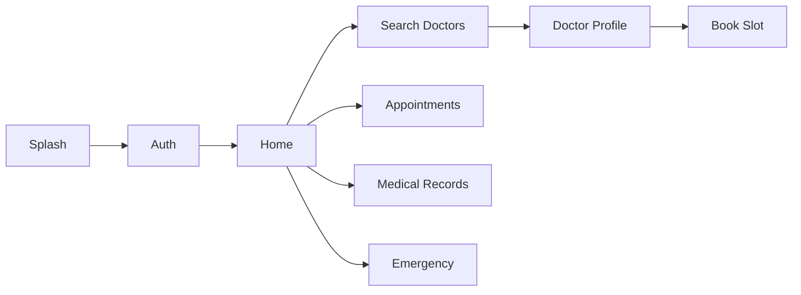

### 5.2 Authentication Flow (Cross-Platform)
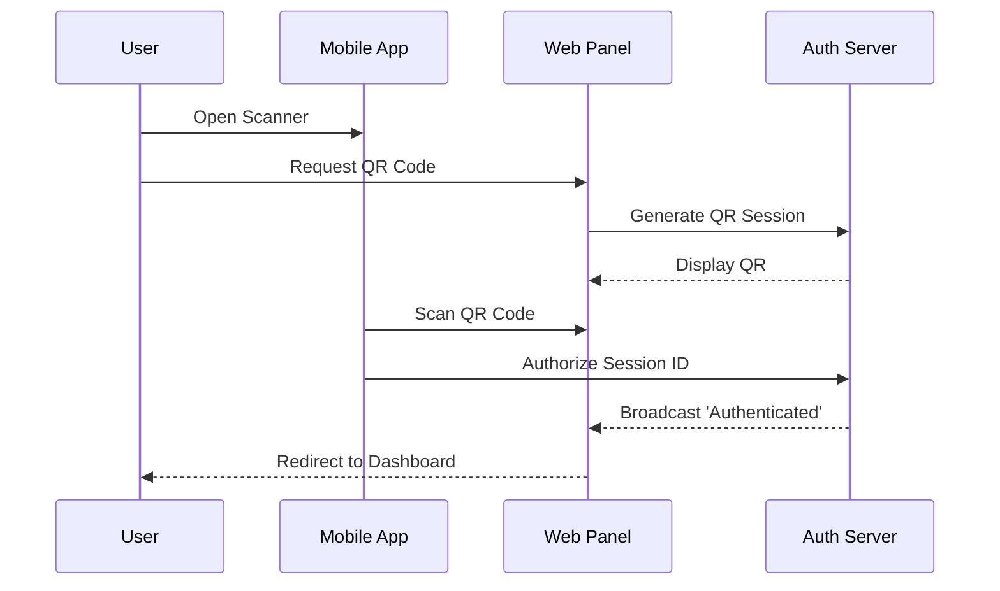

### 5.3 Appointment Flow
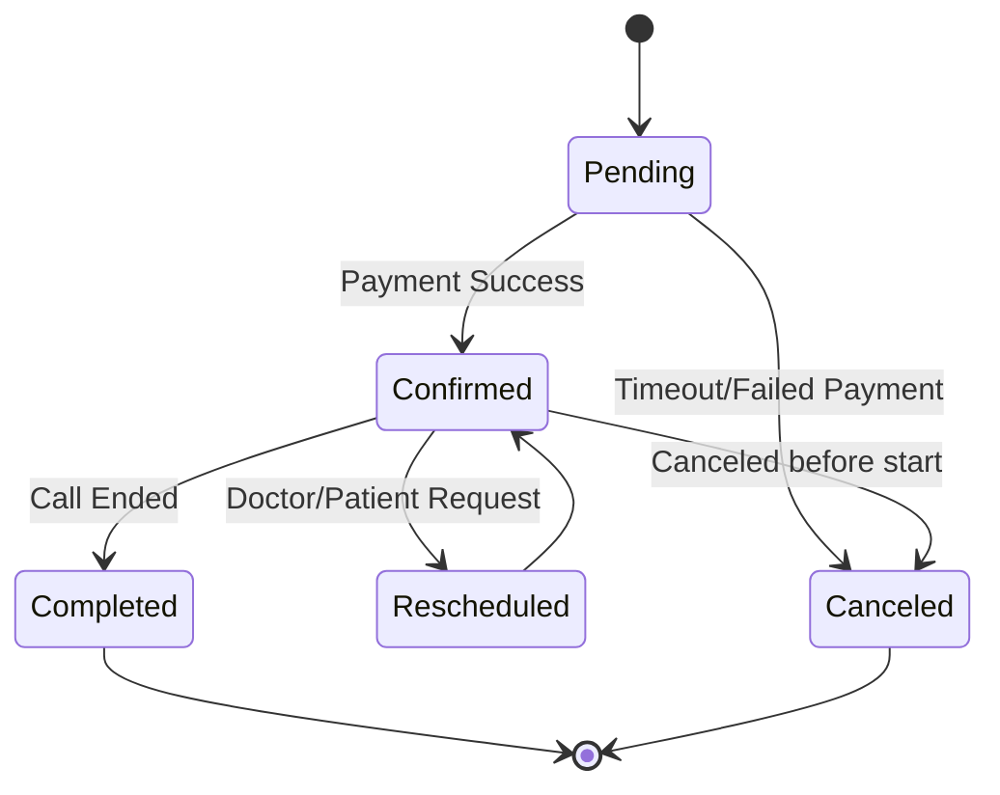

### 5.4 Emergency Flow
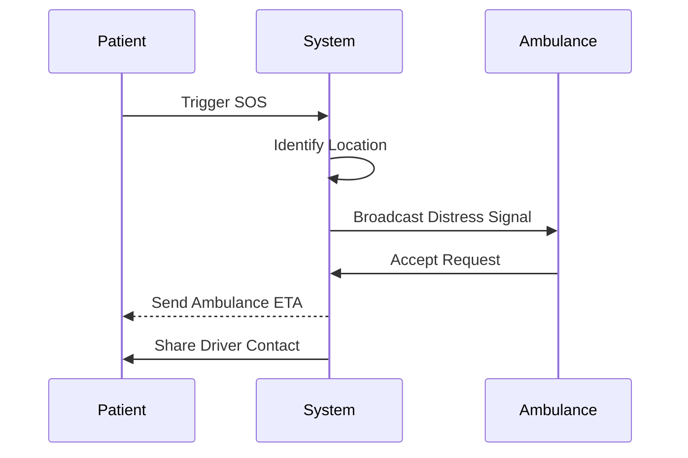

### 5.5 Video Call Flow
```mermaid
sequenceDiagram
    participant Doctor
    participant Server
    participant WebRTC
    participant Patient

    Doctor->>Server: Start Consultation
    Server->>Patient: Send Push Notification (Incoming Call)
    Patient->>Server: Accept Call
    Server->>WebRTC: Generate Room Tokens
    WebRTC-->>Doctor: Connect
    WebRTC-->>Patient: Connect
    Doctor->>Patient: P2P Video Stream
```

### 5.6 Prescription Flow
```mermaid
graph TD
    A[Call Ends] --> B[Doctor Opens Prescription Pad]
    B --> C[Add Medicines & Dosages]
    C --> D[Digitally Sign]
    D --> E[Generate PDF]
    E --> F[Save to Database]
    F --> G[Send Notification to Patient]
    G --> H[Patient Downloads PDF]
```

### 5.7 Notification Flow
```mermaid
graph TD
    A[System Event Triggered] --> B{Check User Settings}
    B -- Enabled --> C[Determine Priority]
    C -- High --> D[Send Push + SMS]
    C -- Normal --> E[Send Push]
    D --> F[Firebase Cloud Messaging]
    E --> F
    F --> G[Deliver to Device]
```

### 5.8 High-Level Decision Tree (Triage)
```mermaid
graph TD
    A{Is it an Emergency?}
    A -- Yes --> B[Trigger SOS & Call Ambulance]
    A -- No --> C{Require Specialist?}
    C -- Yes --> D[Search by Speciality]
    C -- No --> E[Book General Physician]
    D --> F[Book Appointment]
    E --> F
```
